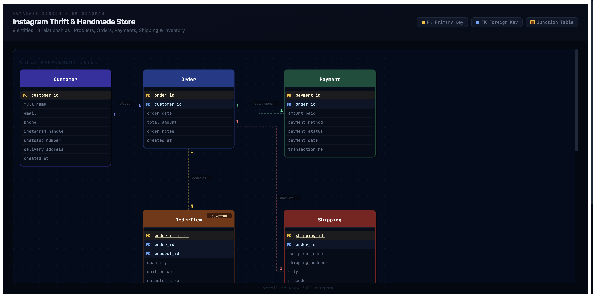
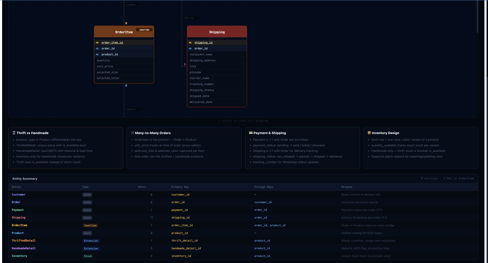
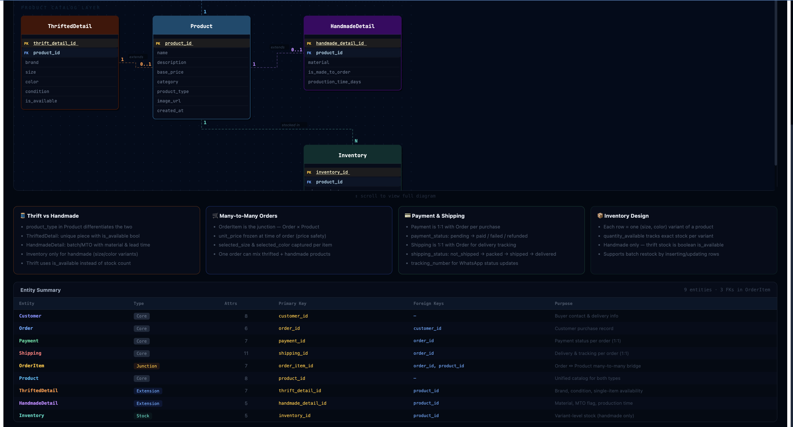

# ChaiCode-ER-Diagram

Interactive ER diagram for an **Instagram Thrift & Handmade Store** database: nine entities, eight relationships, order management and product catalog layers.

Built with React (see `src/ERDiagram.jsx`). Run locally with `npm install` and `npm run dev`.

**Live site:** [https://er-diagram-viewer.vercel.app](https://er-diagram-viewer.vercel.app)

## Screenshots

### Order management layer

Customer, Order, Payment, OrderItem, and Shipping with relationships (places, has payment, contains, ships via).

### Design notes and entity summary

Design rationale cards and the full entity summary table.

### Product catalog layer

Product with ThriftedDetail, HandmadeDetail, and Inventory extensions.

