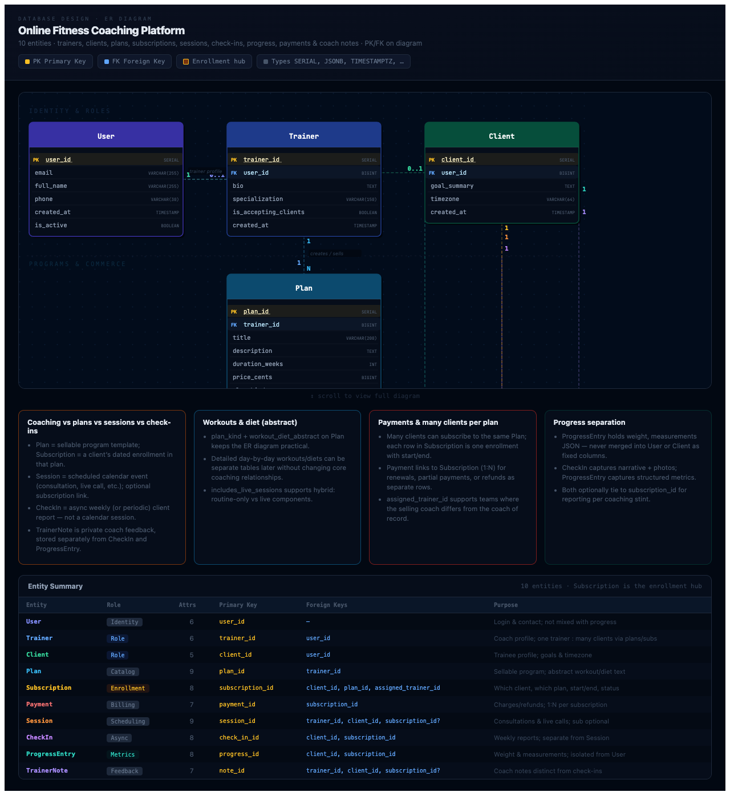

# ChaiCode-ER-Diagram

Interactive ER diagram for an **online fitness coaching platform**: trainers onboard clients, sell plans, schedule consultations and live sessions, manage subscriptions and payments, and track progress through structured metrics, weekly check-ins, and separate coach notes.

**Repository:** [github.com/Armaan-Dip-Singh-Maan/ChaiCode-ER-Diagram](https://github.com/Armaan-Dip-Singh-Maan/ChaiCode-ER-Diagram)

Built with React (see `src/ERDiagram.jsx`). Run locally with `npm install` and `npm run dev`.

---

## Assignment timeline (ChaiCode / evaluation)

| Milestone | Date & time (2026) |
| --- | --- |
| **Start** | Apr 6, 11:30 PM |
| **Due** | Apr 7, 1:00 PM |
| **Eval begins** | Apr 7, 1:30 PM |
| **Eval ends** | Apr 8, 12:29 PM |

---

## Business problem (summary)

A fitness influencer runs **online coaching** (not gym floor management): some clients buy **long-term plans**, some only want **consultations**, some get **live sessions** while others receive **routines and diet guidance**. The database must support onboarding, **subscriptions**, **scheduled sessions**, **weekly check-ins**, **progress** (weight, measurements, reports), and **trainer notes**, with clear separation from core user identity.

---

## Design highlights

| Topic | How it is modeled |
| --- | --- |
| **Trainers vs clients** | `User` is the identity table; `Trainer` and `Client` each reference `user_id` (one profile each when applicable). |
| **Plans vs purchases** | `Plan` is the catalog (created by a trainer). `Subscription` is an **enrollment**: which `client_id`, which `plan_id`, **start/end dates**, **status**, and `assigned_trainer_id`. Many clients can enroll in the same plan over time; one client can have many subscriptions over time. |
| **Sessions vs check-ins** | `Session` = scheduled **calendar** events (consultation, live call, etc.), with optional `subscription_id`. `CheckIn` = **async** periodic client reports — different entity. |
| **Progress** | `ProgressEntry` holds metrics (`weight_kg`, `body_measurements` JSON, etc.), not merged into `User` / `Client`. |
| **Trainer feedback** | `TrainerNote` is separate from `CheckIn` and optional `subscription_id` for context. |
| **Workouts & diet** | Kept **abstract** on `Plan` (`plan_kind`, `workout_diet_abstract`) so the ER stays practical; detailed program tables can be added later without breaking core relationships. |
| **Payments** | `Payment` references `subscription_id` with **1:N** cardinality for renewals, partial payments, or refund rows. |

**Entities (10):** `User`, `Trainer`, `Client`, `Plan`, `Subscription`, `Payment`, `Session`, `CheckIn`, `ProgressEntry`, `TrainerNote`.

---

## Diagram assets in this repo

| Asset | Description |
| --- | --- |
| **Interactive app** | Primary deliverable — pan/zoom-friendly SVG entities with **PK** / **FK** labels and relationship cardinalities. |
| **Static export** | [`docs/images/er-diagram-full.png`](docs/images/er-diagram-full.png) — full-page capture of the deployed-style view (regenerate with `npm run build && npm run preview` and your preferred screenshot tool if needed). |

---

## Deployment (Vercel)

| | |
| --- | --- |
| **Production URL** | [https://er-diagram-viewer.vercel.app](https://er-diagram-viewer.vercel.app) |
| **Hosting** | [Vercel](https://vercel.com) — connected to this repo; pushes to `main` trigger new deploys |

---

## Screenshots

### Full diagram (identity, programs & commerce, sessions & progress)

### Local development

After `npm run dev`, open the printed local URL and scroll the diagram area to inspect layers and the entity summary table at the bottom of the page.

---

## Submission checklist (course expectations)

- [x] Single coherent board (interactive page + optional PNG in `docs/images/`).
- [x] Readable layout, labeled **PK** / **FK**, cardinalities on relationship lines.
- [x] Trainers, clients, plans, subscriptions, sessions, check-ins, progress, payments, and separate trainer notes represented with sensible cardinalities.

---

## License

Project structure and diagram content are provided for coursework / portfolio use.
